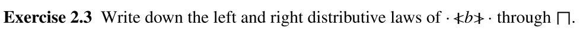

##### Exercise 1.2  

A bank account is a process into which money can be deposited and from which it can be withdrawn. Define first a simple account ACCT0 which has events deposit and withdraw, and which is always prepared to communicate either.
$$
ACCT_0=deposit\to ACCT_0 \square withdraw\to ACCT_0
$$

##### Exercise 1.3

Now extend the alphabet to include open and close. ACCT1 behaves like ACCT0 except that it allows no event before it has been opened, and allows no further event after it has been closed (and is always prepared to accept close while open). You might find it helpful to define a process OPEN representing an open account.
$$
ACCT_1=open\to OPEN\\
OPEN=deposit\to OPEN|withdraw\to OPEN|close
$$

##### Exercise 1.4

ACCT0 and ACCT1 have no concept of a balance. Introduce a parameter representing the balance of an OPEN account. The alphabet is open and close as before, deposit.N and withdraw.N (which have now become channels indicating the amount of the deposit or withdrawal) plus balance.Z (Z is the set of positive and negative integers), a channel that can be used to find out the current balance. An account has a zero balance when opened, and may only be closed when it has a zero balance. Define processes ACCT2 and ACCT3 which (respectively) allow any withdrawal and only allow those which would not overdraw the account (make the balance negative).

$$
ACCT_2=open\to OPEN_0
\\\\
OPEN_t=deposit?x\to OPEN_{t+x}\square\\
withdraw?x\to OPEN_{t-x}\square\\
blance?x:0\to close\\
$$

$$
ACCT_3=open\to OPEN_0
\\\\
OPEN_t=deposit?x\to OPEN_{t+x}\square\\
withdraw?x\{y|y\in(0,t]\}\to OPEN_{t-x}\square\\
blance?x:0\to close\\
$$

##### Exercise 1.5

Extend the definition of COUNTn so that it also has the events up5, up10, down5 and down10 which change the value in the register by the obvious amounts, and are only possible when they do not take this value below zero.
$$
COUNT_n=up5\to COUNT_{n+5}\square\\
up10\to COUNT_{n+10}\square\\
n\ge 5\&down5\to COUNT_{n-5}\square\\
n\ge 10\&down10\to COUNT_{n-10}\square\\
$$

##### Exercise 1.6

A change-giving machine takes in £1 coins and gives change in 5, 10 and 20 pence coins. It should have the following events: in£1, out5p, out10p, out20p. Define versions with the following behaviours:
(a) CMA gives the environment the choice of how it wants the change, and if an extra £1 is inserted while it still has a non-zero balance it increases the amount of change available accordingly.
$$
CMA_n=in100\to CMC_{n+100}\\
\square n\geqslant 5\&out5\to CMC_{n-5}\\
\square n \geqslant 10\& out10\to CMC_{n-10}\\
\square n \geqslant 20\& out20\to CMC_{n-20}\\
$$
(b) CMB behaves like CMA except that it will only accept a further £1 if its balance is less than 20p.
$$
CMA_n=n<20\&in100\to CMC_{n+100}\\
\square n\geqslant 5\&out5\to CMC_{n-5}\\
\square n \geqslant 10\& out10\to CMC_{n-10}\\
\square n \geqslant 20\& out20\to CMC_{n-20}\\
$$
(c) CMC is allowed to choose any correct combination of change nondeterministically, only allowing the insertion of £1 when it has zero balance.

$$
CMC_n=in100\to CMC_{n+100}\vartriangleleft n<5\vartriangleright (\\out5\to CMC_{n-5}\\
\sqcap n \geqslant 10\& out10\to CMC_{n-10}\\
\sqcap n \geqslant 20\& out20\to CMC_{n-20}\\)\\
$$

##### Exercise 1.7

**COPY** represents a one-place buffer and $B_{<>}^{\infty}$ represents an unbounded one. These are just two examples of processes representing communication media for transmitting information from channel left to channel right. Describe ones with the following behaviours (except for the last one, their output streams must always copy the input ones without loss, preserving order):

(a) FCOPY behaves like COPY except that it is allowed to input a second item when it already contains one, but if it does it breaks (STOP).
$$
B_{<>}^{\infty}=left?x\to B_{<x>}^{\infty}\\
B_{<x>}^{\infty}=right!x\to B_{<>}^{\infty} \square left?y \to STOP
$$
(b) DELAY can hold up to two items, but cannot output the first one unless it is full. Thus its outputs are (after the initial input) always one or two behind its inputs, unlike the case with COPY where they are always zero or one behind. 
$$
B_{<>}^{\infty}=left?x\to B_{<x>}^{\infty}\to left?y\to B_{<x><y>}^{\infty}\\
B_{<x><y>}^{\infty}=right!x\to B_{<y>}^{\infty} \square right!y\to B_{<x>}^{\infty}
$$
(c) LEAKY behaves like COPY except that it loses every third item.
$$
B_{<>}^{\infty}=left?x\to right!x\to left?x\to right!x\to left?x\to B_{<>}^{\infty}
$$

##### Exercise 1.8

Create a model of Duncan, who has three states modelled on Asleep, InBed and Up. He chooses nondeterministically between read and sleep when InBed, always offers to eat and play when Up, but may or may not offer to work.
$$
Duncan = Asleep\square InBed\square Up\\
Inbed=read \sqcap sleep\\
Up = (eat\square play)\sqcap work
$$

##### Exercise 2.1 

Using the laws quoted in the text for $\sqcap$, prove that it distributes over itself (i.e., that $P \sqcap(Q\sqcap R) = (P\sqcap Q) \sqcap (P\sqcap R)$).
$$
P \sqcap(Q\sqcap R)=(P\sqcap P) \sqcap(Q\sqcap R)\\
=(P\sqcap P \sqcap Q)\sqcap R\\
=((P\sqcap Q) \sqcap P)\sqcap R\\
=(P\sqcap Q) \sqcap (P\sqcap R)
$$

##### Exercise 2.2

Suggest some laws for $\sqcap S$ and how it relates to $\sqcap$.
$$

$$

##### Exercise 2.3 

